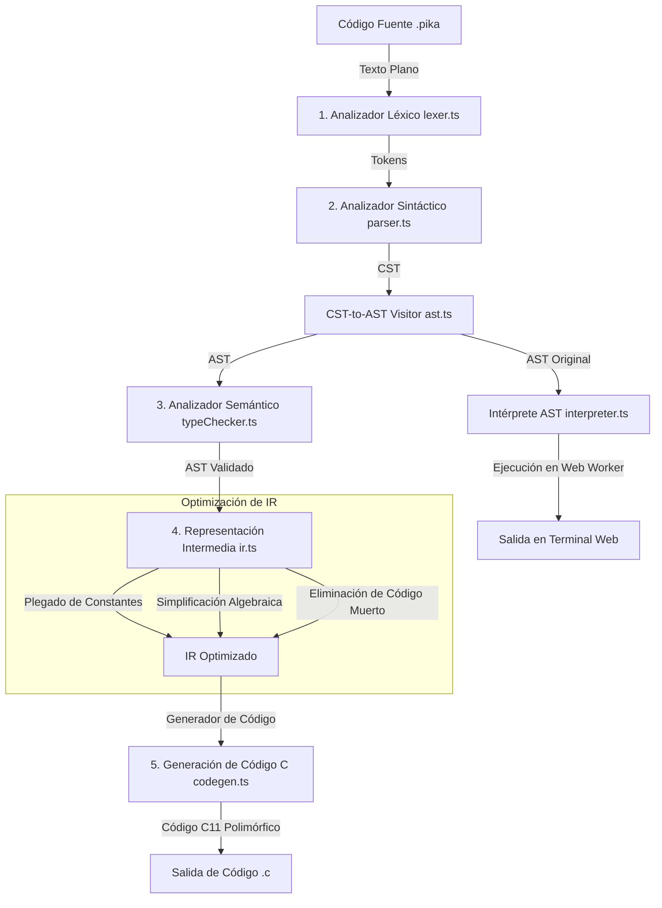

# Documentación Completa del Proyecto: PikaCompiler ⚡

Bienvenido a la documentación oficial de **PikaCompiler**, un compilador educativo interactivo inspirado en la temática de **Pokémon**. El propósito de este proyecto es enseñar los fundamentos de la teoría de compiladores y lenguajes de programación a través de una sintaxis divertida y un pipeline completo de compilación y ejecución.

El lenguaje fuente se denomina **PokeCode** (archivos con extensión `.pika`) y es transpilado a código moderno en **C (C11)**, además de ser ejecutado en tiempo real en la web mediante un **Intérprete de AST** escrito en TypeScript.

---

## 🗺️ Diagrama del Pipeline del Compilador

La siguiente gráfica detalla el flujo de datos desde el código fuente `.pika` hasta su transpilación a C y su ejecución interactiva:



---

## 1. Requisitos e Instalación ⚙️

### Requisitos del Sistema
Para instalar y ejecutar el proyecto localmente en modo de desarrollo, necesitas:
*   **Node.js**: Versión `>= 18 < 19` recomendada (probado en Node 22 también).
*   **pnpm**: Gestor de paquetes oficial del monorrepisitorio (`>= 8.0`).
*   **Git**: Para control de versiones y hooks locales.
*   **Compilador de C** *(Opcional)*: Como `gcc` o `clang` si deseas compilar y ejecutar el código C generado en tu computadora.

### Proceso de Configuración
1.  **Clonar el repositorio**:
    ```bash
    git clone <url-del-repositorio> pikaCompiler
    cd pikaCompiler
    ```
2.  **Instalar dependencias del workspace**:
    Desde la raíz del repositorio, ejecuta:
    ```bash
    pnpm install
    ```
    Esto instalará las dependencias tanto para las herramientas globales del compilador como para el frontend web.

3.  **Configurar hooks de git (Husky)**:
    Para dejar listos los hooks de formateo y validación pre-commit, ejecuta:
    ```bash
    pnpm --dir web run prepare
    ```

---

## 2. Flujo de Desarrollo y Scripts 🛠️

El proyecto está organizado como un espacio de trabajo administrado por `pnpm` y orquestado mediante `TurboRepo` para acelerar tareas repetitivas.

### Comandos de Desarrollo
Desde la raíz del proyecto, puedes utilizar los siguientes comandos:

*   **Levantar entorno web en desarrollo**:
    ```bash
    pnpm dev
    ```
    Levanta un servidor Vite local en `http://localhost:5173`.
*   **Construir para producción**:
    ```bash
    pnpm build
    ```
    Compila el compilador web y genera el bundle optimizado en la carpeta `web/dist`.
*   **Ejecutar pruebas unitarias**:
    ```bash
    pnpm test
    ```
    Ejecuta las suites de prueba en modo interactivo/watch utilizando **Vitest**.
*   **Correr Linter (ESLint)**:
    ```bash
    pnpm lint
    ```
    Inspecciona el código fuente en búsqueda de malas prácticas y discrepancias de tipos.
*   **Autoformatear código (Prettier)**:
    ```bash
    pnpm format
    ```
    Formatea automáticamente todos los archivos `.ts`, `.tsx`, `.json`, `.css` y `.md` del proyecto.

### Commits Convencionales
El proyecto utiliza commits semánticos bajo el estándar de **Conventional Commits**. Para facilitar la creación de mensajes de commit, utiliza los scripts provistos en la raíz:
*   En Windows: `.\scripts\commit.ps1`
*   En macOS/Linux: `./scripts/commit.sh`
*   Alternativamente en la subcarpeta `web`: `pnpm --dir web run commit`

---

## 3. Especificación del Lenguaje PokeCode 📝

### Equivalencias del Sistema de Tipos (Poké Balls)

Para declarar variables y estructuras en PokeCode, se utilizan diferentes clases de Poké Balls que representan los tipos primitivos:

| Poké Ball | Tipo Equivalente | Descripción | Ejemplo de Uso |
| :--- | :--- | :--- | :--- |
| **`PokeBall`** | `int` (Entero) | Números enteros de 32 bits. | `CAPTURA nivel EN PokeBall CON 5;` |
| **`SuperBall`** | `float` (Decimal) | Números de punto flotante. | `CAPTURA ratio EN SuperBall CON 0.75;` |
| **`UltraBall`** | `string` (Cadena) | Cadenas de texto entre comillas. | `CAPTURA nombre EN UltraBall CON "Pikachu";` |
| **`MasterBall`** | `bool` (Booleano) | Valores lógicos de verdadero/falso. | `CAPTURA capturado EN MasterBall CON true;` |

### Conceptos del Lenguaje

#### 1. Funciones
*   **Función Principal (`PUEBLO_NATAL`)**: Equivale a la función `main` del programa. No recibe parámetros y debe estar presente para la ejecución.
*   **Funciones Auxiliares (`MOVIMIENTO`)**: Representan subrutinas o funciones secundarias. Pueden recibir parámetros tipados y declarar tipos de retorno.
    ```pika
    MOVIMIENTO calcular_danio(nivel: PokeBall, ataque: SuperBall) RETORNA SuperBall {
      RETORNA nivel * ataque;
    }
    ```

#### 2. Declaraciones
*   **Variables Simples (`CAPTURA`)**: Declara una variable inyectando un valor inicial.
    ```pika
    CAPTURA ps EN PokeBall CON 100;
    ```
*   **Vectores / Arreglos (`EQUIPO`)**: Crea un array estático de elementos. Se requiere especificar una capacidad de almacenamiento de **1 a 6 elementos** (el límite clásico de Pokémon).
    ```pika
    EQUIPO party DE PokeBall CAPACIDAD 3;
    party[0] = 50;
    ```
*   **Pilas Dinámicas (`MOCHILA`)**: Estructura dinámica de tipo LIFO (Last In, First Out). Soporta operaciones nativas:
    *   `GUARDAR(mochila, valor);` (Push)
    *   `SACAR(mochila)` (Pop)
    *   `CANTIDAD_DE(mochila)` (Size/Length)
*   **Punteros (`RADAR`)**: Punteros tipados que apuntan a la dirección de memoria de una variable.
    *   `radar = UBICACION_DE(variable);` (Referencia `&` en C)
    *   `MIRAR_RADAR(radar) = valor;` (Desreferenciación `*` en C)

#### 3. Estructuras de Control
*   **Bifurcación Condicional (`SI_ENTRENADOR_DESAFIA`)**: Estructura `if` / `else`.
    ```pika
    SI_ENTRENADOR_DESAFIA (ps < 20) {
      DICE_PROF_OAK("¡Peligro!");
    } SINO {
      DICE_PROF_OAK("Combate normal.");
    }
    ```
*   **Ciclos (`MIENTRAS_TENGA_PS`)**: Bucle `while` que ejecuta sentencias en bucle mientras la condición sea verdadera.
    ```pika
    MIENTRAS_TENGA_PS (contador < 5) {
      contador = contador + 1;
    }
    ```

---

## 4. Arquitectura del Compilador (Las 5 Fases) 🏛️

El núcleo del compilador vive en [`web/src/compiler/`](file:///c:/Users/Usuario/OneDrive/Desktop/Compilador%20y%20lenguaje/pikaCompiler/web/src/compiler). Está implementado de forma modular en TypeScript:

### Fase 1: Análisis Léxico (`lexer.ts`)
Utiliza **Chevrotain** para escanear el código y agruparlo en tokens. Filtra comentarios (`//` y `/* */`) y espacios en blanco. Si se introduce un carácter ilegal (como `@` o `$`), arroja un error léxico con la posición exacta de línea y columna.

### Fase 2: Análisis Sintáctico y AST (`parser.ts` y `ast.ts`)
*   **`parser.ts`**: Implementa las reglas gramaticales en notación EBNF usando un parser por descenso recursivo provisto por Chevrotain. Valida la estructura jerárquica del lenguaje y produce un Árbol de Sintaxis Concreta (CST).
*   **`ast.ts`**: Mediante un visitante de CST (`PokeCstVisitor`), simplifica y transforma las reglas sintácticas del CST en un Árbol de Sintaxis Abstracta (AST) tipado bajo interfaces de TypeScript (ej. `ProgramNode`, `FunctionDeclNode`, `BinOpNode`).

### Fase 3: Análisis Semántico (`semantics/`)
Se divide en:
*   **`symbolTable.ts`**: Administra la tabla de símbolos para realizar seguimiento de qué variables y funciones han sido declaradas, controlando ámbitos locales y globales.
*   **`collector.ts`**: Escanea las declaraciones del cuerpo del programa y llena las tablas de símbolos correspondientes.
*   **`typeChecker.ts`**: Aplica reglas de validación semántica:
    *   Verificación de tipos en asignaciones y retornos.
    *   Control de tamaño de arreglos `EQUIPO` (debe ser $\ge 1$ y $\le 6$).
    *   Comprobación estática de límites (*bounds checking*) de índices de arreglos si el índice es un entero literal.
    *   Asegurar que operaciones de radar o mochilas solo se apliquen en tipos correspondientes.
    *   Restringir que `DEVOLVER_A_LA_BALL` solo sea legal dentro de funciones marcadas como `MOVIMIENTO`.

### Fase 4: Representación Intermedia y Optimización (`ir.ts`)
Reduce el AST validado en una estructura linealizada e intermedia llamada `IRProgram`:
*   **Plegado de Constantes (Constant Folding)**: Evalúa expresiones binarias con operandos estáticos. Por ejemplo: `CAPTURA x EN PokeBall CON 15 + 5;` se optimiza directamente a `x = 20`.
*   **Simplificación Algebraica**: Reduce operaciones inútiles en tiempo de compilación:
    *   `x + 0` $\rightarrow$ `x`
    *   `x * 1` $\rightarrow$ `x`
    *   `x * 0` $\rightarrow$ `0`
*   **Eliminación de Código Muerto (DCE)**: Si un condicional evalúa un literal constante precalculado (ej. `SI_ENTRENADOR_DESAFIA(true)` o `SI_ENTRENADOR_DESAFIA(false)`), la bifurcación condicional se destruye y solo se conserva el bloque ejecutable, descartando el código inalcanzable.

### Fase 5: Generación de Código C (`codegen.ts`)
Transpila la IR optimizada a un archivo C11 estándar. Incorpora:
*   Tipos nativos correspondientes (`int`, `float`, `const char*`, `bool`).
*   Implementaciones genéricas de las estructuras de tipo **Mochila** mediante structs dinámicos con capacidad y punteros.
*   **Uso de `_Generic`**: Implementa macros polimórficas de C11 para sobrecargar funciones integradas. Por ejemplo, `DICE_PROF_OAK(x)` se expande a la función de impresión correcta (`print_int`, `print_float`, `print_string`) en base al tipo de la variable provista.
*   Punteros nativos para la sintaxis de `RADAR`.

---

## 5. El Intérprete y Ejecutor 🏃‍♂️

El archivo [`web/src/compiler/interpreter.ts`](file:///c:/Users/Usuario/OneDrive/Desktop/Compilador y lenguaje/pikaCompiler/web/src/compiler/interpreter.ts) contiene un motor de ejecución directo para el AST.

### Características del Intérprete
*   **Árbitos Anidados (`RuntimeEnv`)**: Administra un mapa de variables local con una referencia a un entorno padre, permitiendo variables de funciones locales y globales de manera limpia.
*   **Captura de Salida**: Sobrescribe el comportamiento de `DICE_PROF_OAK` para redirigir los mensajes impresos a un búfer interno de strings (`output`).
*   **Manejo de Punteros**: Simula el comportamiento de un radar direccionando referencias a objetos y permitiendo reasignaciones de valores a través del radar (`MIRAR_RADAR(radar) = valor`).
*   **Detección de Bucles Infinitos**: El bucle `MIENTRAS_TENGA_PS` tiene un contador de seguridad que interrumpe la ejecución con un error semántico de runtime si se ejecutan más de 10,000 iteraciones consecutivas.
*   **Captura de Errores de Ejecución**: Atrapa errores en tiempo de ejecución (como desbordamiento de índices, variables no declaradas o tipos erróneos) para notificarlos en la consola.

---

## 6. La Aplicación Web Frontend 💻

La aplicación web interactiva está construida en **Vite + React + TypeScript** (ubicada en [`web/src/`](file:///c:/Users/Usuario/OneDrive/Desktop/Compilador%20y%20lenguaje/pikaCompiler/web/src)).

### Arquitectura de la Interfaz
```
[Editor Monaco (.pika)]  ====(Código)====> [Web Worker (compiler.worker.ts)]
                                                      ||
                                              (Proceso en Background)
                                                      ||
[Consola de Oak / Terminal] <==(Resultados/Errores)==  
```

### Componentes de la Interfaz
1.  **Editor Monaco**:
    *   Usa el editor de código integrado de VS Code en la web.
    *   **Monarch Highlighter**: Registra la definición léxica de `pika` para dar coloreado visual y estilos a las palabras reservadas.
    *   **Limpieza de marcadores**: Al momento en que el usuario empieza a tipear de nuevo para corregir un código, el editor borra los indicadores de error inmediatamente para no interrumpir el flujo.
2.  **Web Worker (`compiler.worker.ts`)**:
    *   El compilador corre dentro de un Web Worker independiente. Esto garantiza que el hilo de interfaz de usuario de React se mantenga a 60 FPS, sin congelarse incluso si el usuario genera un ciclo infinito en el editor web.
3.  **Terminal de Ejecución**:
    *   Un emulador de consola UNIX de estética retro que muestra la salida del intérprete.
    *   Cambia de pestaña automáticamente al compilar.
    *   Si hay un error en el código, el editor de código Monaco **resalta la línea del error** en rojo translúcido, pone un punto rojo en el margen y posiciona el cursor y foco directamente sobre la línea con problemas. Al mismo tiempo, la terminal imprime en rojo la descripción del error de compilación.

---

## 7. Pruebas y Calidad de Código 🧪

El compilador cuenta con un excelente set de pruebas automatizadas en [`web/src/compiler/`](file:///c:/Users/Usuario/OneDrive/Desktop/Compilador%20y%20lenguaje/pikaCompiler/web/src/compiler) que cubren cada fase de la tubería:

*   **`lexer.test.ts`**: Prueba que los caracteres válidos generen los tokens correspondientes y que los caracteres inválidos arrojen los errores léxicos esperados.
*   **`ast.test.ts`**: Valida que la transformación del CST al AST sea correcta para sentencias como asignaciones, condicionales, funciones y llamadas de radar.
*   **`semantics.test.ts`**: Valida que el type checker detecte colisiones de variables, tipos incompatibles, límites fuera de rango en arreglos y uso prohibido de `DEVOLVER_A_LA_BALL`.
*   **`ir.test.ts`**: Prueba las optimizaciones de plegado de constantes, simplificación algebraica y reducción de bloques redundantes (`If`s con condiciones constantes).
*   **`codegen.test.ts`**: Verifica que la salida del transpilador a C genere código de C11 estructural y macro-polimórfico válido.
*   **`e2e.test.ts`**: Prueba la tubería entera de compilación (desde el código fuente `.pika` hasta el archivo `.c` final) para tres casos de prueba integrales (Combates, Equipos, Punteros).

---

¡Pika-Pika! Con esto concluye la documentación extendida de **PikaCompiler**. Puedes explorar el código fuente haciendo clic en los archivos vinculados a lo largo de este documento.
